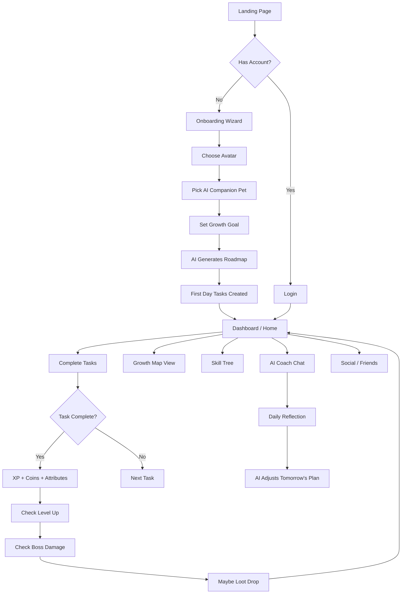
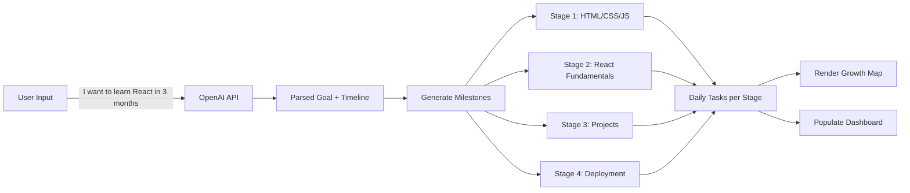
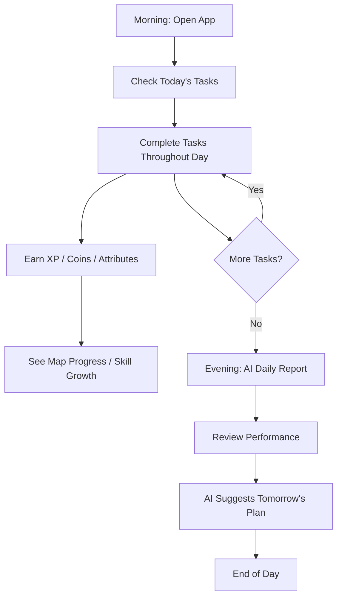
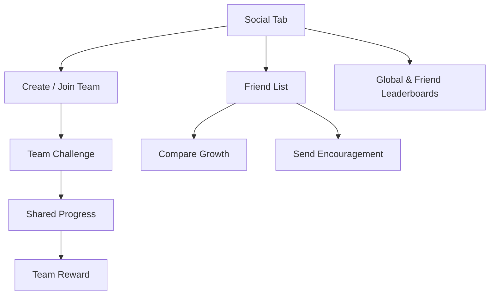
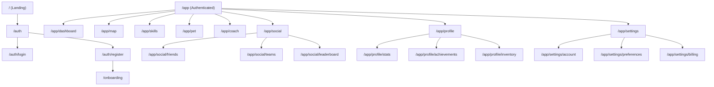
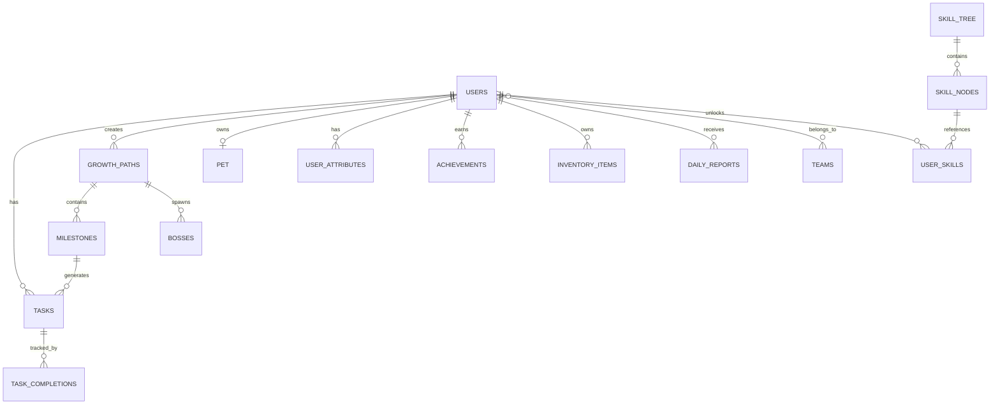
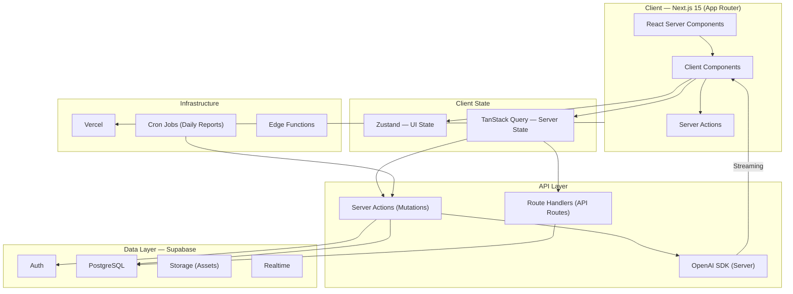
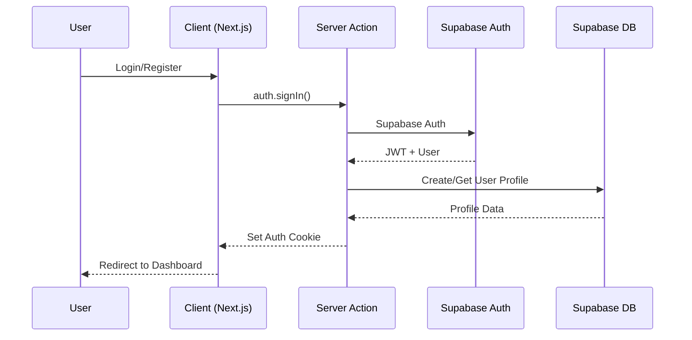
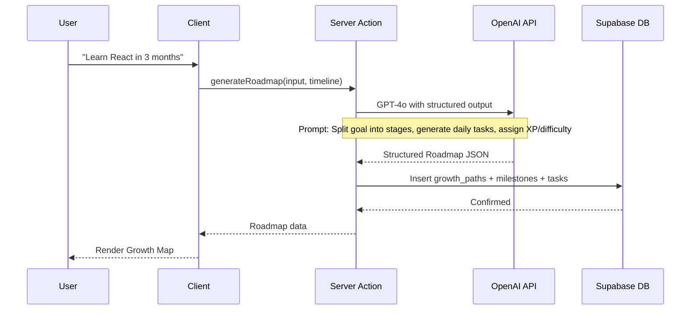
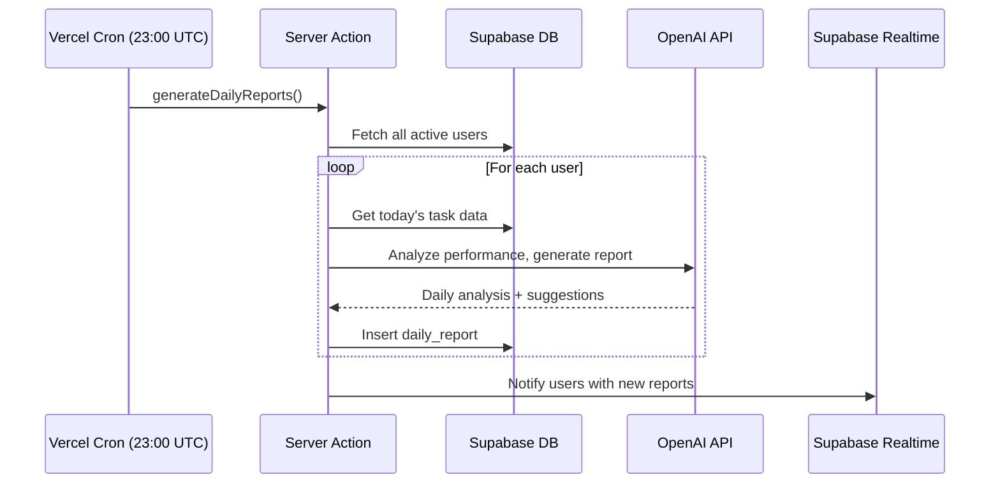

# Level Up — Product Requirements Document

> **Version:** 1.0  
> **Status:** Planning Phase  
> **Last Updated:** 2026-06-29  
> **Author:** Level Up Product Team

---

## Table of Contents

1. [Product Overview](#1-product-overview)
2. [User Flow](#2-user-flow)
3. [Information Architecture](#3-information-architecture)
4. [Database Design](#4-database-design)
5. [Page Structure](#5-page-structure)
6. [UI Style Guide](#6-ui-style-guide)
7. [Design System](#7-design-system)
8. [MVP Feature Priority](#8-mvp-feature-priority)
9. [Technical Architecture](#9-technical-architecture)
10. [Project Directory Structure](#10-project-directory-structure)

---

## 1. Product Overview

### 1.1 Mission Statement

"把现实人生变成一款 RPG 游戏。"  
*Turn real life into an RPG game.*

### 1.2 Problem Statement

Traditional productivity tools treat users as task-completion machines. They're boring, punitive, and fail to create lasting behavior change. Gamification products like Habitica lean on pixel-art nostalgia and shallow reward loops that lose novelty within weeks.

**The gap:** There is no product that combines:
- AI-powered adaptive growth planning (like ChatGPT-level intelligence)
- Deep game mechanics (RPG progression, skill trees, boss battles)
- Modern, premium design language (Apple/Linear/Raycast quality)
- A genuine sense of personal evolution

### 1.3 Core Value Proposition

| Pillar | Description |
|--------|-------------|
| **AI Growth Engine** | Natural language → structured growth roadmap → daily adaptive tasks |
| **RPG Progression** | XP, levels, attributes, skill trees, bosses, pets, loot — real depth |
| **Visual Growth Map** | Your learning journey rendered as an evolving world map |
| **AI Coach** | Daily analysis, reflection, and adaptive planning |
| **Premium Craft** | Dark-first, glassmorphism, motion-rich, spatial — feels like a next-gen AI product |

### 1.4 Target Users

**Primary:** Tech-forward knowledge workers (20-35) who already use Notion, Linear, Arc, and ChatGPT. They value aesthetics and demand intelligence from their tools.

**Secondary:** Students, indie makers, and self-improvement enthusiasts who want structure + motivation.

### 1.5 Competitive Landscape

| Product | Strengths | Weaknesses |
|---------|-----------|------------|
| **Habitica** | Gameified habits, social | Pixel art, no AI, dated UX |
| **Notion** | Flexible, beautiful | No game layer, no AI growth planning |
| **Duolingo** | Great gamification, streaks | Single domain (language only) |
| **Finch** | Cute, emotional | Too casual, no depth, juvenile aesthetic |
| **Todoist** | Clean, fast | Zero game mechanics |

**Level Up's edge:** AI + deep RPG + premium design — a category-defining product.

### 1.6 Success Metrics

| Metric | Target (6 months) |
|--------|-------------------|
| DAU / MAU | > 40% |
| Daily task completion rate | > 70% |
| 7-day retention | > 60% |
| 30-day retention | > 40% |
| AI roadmap generation usage | > 80% of active users |
| NPS | > 50 |


---

## 2. User Flow

### 2.1 Core User Journey



### 2.2 AI Growth Roadmap Flow



### 2.3 Daily Usage Loop



### 2.4 Social Flow



---

## 3. Information Architecture

### 3.1 Sitemap



### 3.2 Navigation Structure

```
App Shell (Persistent)
├── Top Bar
│   ├── User Avatar + Level Badge
│   ├── XP Progress Bar (compact)
│   ├── Streak Counter
│   └── Quick Action: New Roadmap
├── Sidebar (Collapsible)
│   ├── 🏠 Dashboard
│   ├── 🗺️ Growth Map
│   ├── 🌳 Skill Tree
│   ├── 🐾 AI Companion
│   ├── 🤖 AI Coach
│   ├── 👥 Social
│   ├── 👤 Profile
│   └── ⚙️ Settings
└── Main Content Area
    └── (Route-specific content)
```

---

## 4. Database Design

### 4.1 Entity-Relationship Overview



### 4.2 Table Definitions

#### `users`

| Column | Type | Description |
|--------|------|-------------|
| `id` | UUID (PK) | Supabase Auth UID |
| `username` | TEXT (UNIQUE) | Display name |
| `avatar_type` | TEXT | Selected avatar class |
| `avatar_customization` | JSONB | Color, accessories, etc. |
| `level` | INT | Current level (default: 1) |
| `xp` | INT | Current XP (default: 0) |
| `xp_to_next` | INT | XP needed for next level |
| `coins` | INT | In-game currency |
| `streak_days` | INT | Consecutive active days |
| `longest_streak` | INT | Best streak ever |
| `last_active_date` | DATE | Last day with completed task |
| `timezone` | TEXT | IANA timezone string |
| `onboarding_completed` | BOOL | Onboarding wizard done |
| `created_at` | TIMESTAMPTZ | Account creation |
| `updated_at` | TIMESTAMPTZ | Last update |

#### `tasks`

| Column | Type | Description |
|--------|------|-------------|
| `id` | UUID (PK) | Task ID |
| `user_id` | UUID (FK → users) | Owner |
| `milestone_id` | UUID (FK → milestones, nullable) | Parent milestone |
| `title` | TEXT | Task name |
| `description` | TEXT | Details |
| `difficulty` | ENUM | easy/medium/hard/epic |
| `category` | ENUM | learn/fitness/work/read/code/build |
| `xp_reward` | INT | XP granted on completion |
| `coin_reward` | INT | Coins granted |
| `attribute_rewards` | JSONB | e.g. {"knowledge": 5, "discipline": 3} |
| `scheduled_date` | DATE | Target completion date |
| `is_recurring` | BOOL | Daily/weekly habit |
| `recurrence_rule` | TEXT | RRULE string |
| `status` | ENUM | pending/in_progress/completed/skipped |
| `completed_at` | TIMESTAMPTZ | Completion timestamp |
| `ai_generated` | BOOL | Created by AI |
| `created_at` | TIMESTAMPTZ | Creation timestamp |

#### `growth_paths`

| Column | Type | Description |
|--------|------|-------------|
| `id` | UUID (PK) | Path ID |
| `user_id` | UUID (FK → users) | Owner |
| `title` | TEXT | "Learn React in 3 Months" |
| `description` | TEXT | AI-generated overview |
| `goal_input` | TEXT | Original user input |
| `category` | ENUM | Category of growth |
| `target_completion` | DATE | Target end date |
| `status` | ENUM | active/completed/abandoned |
| `current_stage` | INT | Which stage user is on |
| `total_stages` | INT | Total number of stages |
| `map_theme` | TEXT | Visual theme for map |
| `ai_roadmap_json` | JSONB | Full AI-generated roadmap |
| `created_at` | TIMESTAMPTZ | Creation timestamp |

#### `milestones`

| Column | Type | Description |
|--------|------|-------------|
| `id` | UUID (PK) | Milestone ID |
| `growth_path_id` | UUID (FK → growth_paths) | Parent path |
| `stage_number` | INT | Order in path (1, 2, 3...) |
| `title` | TEXT | "Stage 1: HTML Foundations" |
| `description` | TEXT | What this stage covers |
| `map_location` | TEXT | "Forest of Syntax" |
| `xp_bonus` | INT | Bonus XP for completing stage |
| `boss_name` | TEXT | "Procrastination Dragon" (nullable) |
| `boss_hp` | INT | 1000 |
| `status` | ENUM | locked/active/completed |
| `started_at` | TIMESTAMPTZ | When unlocked |
| `completed_at` | TIMESTAMPTZ | When finished |

#### `user_attributes`

| Column | Type | Description |
|--------|------|-------------|
| `user_id` | UUID (FK → users) | Owner |
| `strength` | INT | Physical power |
| `knowledge` | INT | Learning capacity |
| `health` | INT | Wellness |
| `creativity` | INT | Creative output |
| `discipline` | INT | Consistency |
| `communication` | INT | Social skills |
| `updated_at` | TIMESTAMPTZ | Last attribute change |

#### `pets`

| Column | Type | Description |
|--------|------|-------------|
| `id` | UUID (PK) | Pet ID |
| `user_id` | UUID (FK → users, UNIQUE) | Owner |
| `species` | ENUM | fox/cat/robot/dragon |
| `name` | TEXT | User-given name |
| `evolution_stage` | INT | 1-5 |
| `xp` | INT | Pet XP |
| `mood` | ENUM | happy/neutral/sleepy/excited |
| `accessories` | JSONB | Equipped items |
| `hatched_at` | TIMESTAMPTZ | When acquired |
| `last_fed` | TIMESTAMPTZ | Last interaction |

#### `skill_tree_nodes`

| Column | Type | Description |
|--------|------|-------------|
| `id` | UUID (PK) | Node ID |
| `parent_id` | UUID (FK → self, nullable) | Parent skill |
| `name` | TEXT | "React" |
| `category` | TEXT | "Programming" |
| `depth` | INT | Tree depth level |
| `icon` | TEXT | Icon identifier |
| `xp_required` | INT | XP to unlock |
| `prerequisite_nodes` | UUID[] | Required prior skills |

#### `user_skills`

| Column | Type | Description |
|--------|------|-------------|
| `user_id` | UUID (FK → users) | Owner |
| `skill_node_id` | UUID (FK → skill_tree_nodes) | Skill reference |
| `progress` | FLOAT | 0.0 - 1.0 |
| `unlocked` | BOOL | Fully unlocked |
| `unlocked_at` | TIMESTAMPTZ | When unlocked |

#### `achievements`

| Column | Type | Description |
|--------|------|-------------|
| `id` | UUID (PK) | Achievement ID |
| `key` | TEXT (UNIQUE) | "first_streak_7" |
| `name` | TEXT | "Consistency Apprentice" |
| `description` | TEXT | "Maintain a 7-day streak" |
| `icon` | TEXT | Achievement icon |
| `category` | TEXT | streak/skill/combat/collection |
| `rarity` | ENUM | common/rare/epic/legendary |

#### `user_achievements`

| Column | Type | Description |
|--------|------|-------------|
| `user_id` | UUID (FK → users) | Owner |
| `achievement_id` | UUID (FK → achievements) | Achievement |
| `earned_at` | TIMESTAMPTZ | When earned |

#### `inventory_items`

| Column | Type | Description |
|--------|------|-------------|
| `id` | UUID (PK) | Item ID |
| `key` | TEXT (UNIQUE) | "golden_sword" |
| `name` | TEXT | "Golden Sword" |
| `type` | ENUM | equipment/consumable/cosmetic/title |
| `rarity` | ENUM | common/rare/epic/legendary |
| `slot` | ENUM (nullable) | head/weapon/armor/accessory/pet |
| `attributes_bonus` | JSONB | Stat bonuses |
| `icon` | TEXT | Icon identifier |

#### `user_inventory`

| Column | Type | Description |
|--------|------|-------------|
| `user_id` | UUID (FK → users) | Owner |
| `item_id` | UUID (FK → inventory_items) | Item |
| `quantity` | INT | Count |
| `equipped` | BOOL | Currently equipped |

#### `daily_reports`

| Column | Type | Description |
|--------|------|-------------|
| `id` | UUID (PK) | Report ID |
| `user_id` | UUID (FK → users) | Owner |
| `report_date` | DATE | Which day |
| `tasks_completed` | INT | Count |
| `tasks_total` | INT | Total assigned |
| `completion_rate` | FLOAT | 0.0 - 1.0 |
| `xp_earned` | INT | XP today |
| `coins_earned` | INT | Coins today |
| `peak_focus_time` | TIME | Best productivity window |
| `ai_analysis` | TEXT | AI-written analysis |
| `ai_suggestions` | TEXT | AI suggestions for tomorrow |
| `mood_rating` | INT (nullable) | User self-report 1-5 |
| `created_at` | TIMESTAMPTZ | Generated time |

#### `teams`

| Column | Type | Description |
|--------|------|-------------|
| `id` | UUID (PK) | Team ID |
| `name` | TEXT | Team name |
| `description` | TEXT | Team description |
| `owner_id` | UUID (FK → users) | Team creator |
| `max_members` | INT | 5 default |
| `total_xp` | INT | Aggregate XP |
| `created_at` | TIMESTAMPTZ | Creation |

#### `team_members`

| Column | Type | Description |
|--------|------|-------------|
| `team_id` | UUID (FK → teams) | Team |
| `user_id` | UUID (FK → users) | Member |
| `role` | ENUM | owner/admin/member |
| `joined_at` | TIMESTAMPTZ | Join date |

#### `team_challenges`

| Column | Type | Description |
|--------|------|-------------|
| `id` | UUID (PK) | Challenge ID |
| `team_id` | UUID (FK → teams) | Team |
| `title` | TEXT | "Weekly Coding Sprint" |
| `target` | INT | 50 tasks |
| `reward_coins` | INT | Team reward |
| `starts_at` | TIMESTAMPTZ | Start |
| `ends_at` | TIMESTAMPTZ | End |
| `status` | ENUM | active/completed/failed |

#### `friendships`

| Column | Type | Description |
|--------|------|-------------|
| `user_id` | UUID (FK → users) | User |
| `friend_id` | UUID (FK → users) | Friend |
| `status` | ENUM | pending/accepted/blocked |
| `created_at` | TIMESTAMPTZ | When requested |

### 4.3 Row-Level Security (RLS) Strategy

All tables with `user_id` columns will have RLS policies ensuring users can only read/write their own data. Team tables will have team-member-scoped policies. Public profile data (leaderboard) will have limited read-only policies.

---

## 5. Page Structure

### 5.1 Route Map

| Route | Page | Priority |
|-------|------|----------|
| `/` | Landing Page | P1 |
| `/auth/login` | Login | P0 |
| `/auth/register` | Register | P0 |
| `/onboarding` | Onboarding Wizard | P0 |
| `/app/dashboard` | Dashboard (Home) | P0 |
| `/app/map` | Growth Map | P0 |
| `/app/map/[pathId]` | Specific Growth Path | P0 |
| `/app/skills` | Skill Tree | P1 |
| `/app/pet` | AI Companion | P1 |
| `/app/coach` | AI Coach Chat | P0 |
| `/app/social` | Social Hub | P2 |
| `/app/social/friends` | Friends List | P2 |
| `/app/social/teams` | Teams | P2 |
| `/app/social/teams/[teamId]` | Team Detail | P2 |
| `/app/social/leaderboard` | Leaderboard | P2 |
| `/app/profile` | Profile | P1 |
| `/app/profile/stats` | Statistics | P2 |
| `/app/profile/achievements` | Achievements | P1 |
| `/app/profile/inventory` | Inventory | P2 |
| `/app/settings` | Settings | P0 |
| `/app/settings/account` | Account Settings | P0 |
| `/app/settings/preferences` | Preferences | P2 |
| `/app/settings/billing` | Billing (Future) | P3 |

### 5.2 Component Hierarchy — Dashboard (Home)

```
DashboardPage
├── AppShell
│   ├── TopBar
│   │   ├── Logo
│   │   ├── StreakBadge
│   │   ├── CoinDisplay
│   │   ├── NotificationBell
│   │   └── UserMenu
│   └── Sidebar
│       ├── NavItem (Dashboard)
│       ├── NavItem (Growth Map)
│       ├── NavItem (Skill Tree)
│       ├── NavItem (Companion)
│       ├── NavItem (AI Coach)
│       ├── NavItem (Social)
│       └── NavItem (Settings)
├── DashboardGrid
│   ├── HeroCard
│   │   ├── Avatar (illustrated)
│   │   ├── LevelDisplay
│   │   ├── XPProgressRing
│   │   └── TitleBadge
│   ├── TodayTasksCard
│   │   ├── TaskList
│   │   │   └── TaskItem (xN)
│   │   │       ├── Checkbox
│   │   │       ├── DifficultyBadge
│   │   │       ├── RewardPreview
│   │   │       └── CompletionAnimation
│   │   └── AddTaskButton
│   ├── MiniMapCard
│   │   ├── CurrentLocation
│   │   └── ProgressIndicator
│   ├── AISuggestionCard
│   │   ├── SuggestionText
│   │   └── ActionButtons
│   ├── AttributeBars
│   │   └── AttributeBar (x6)
│   └── GrowthChartCard
│       └── WeeklyActivityChart
└── CompletionCelebration (Overlay)
    ├── ParticlesEffect
    ├── XPAnimation
    └── LootDropModal
```

### 5.3 Component Hierarchy — Growth Map

```
GrowthMapPage
├── PathSelector (horizontal scroll)
│   └── PathCard (xN)
├── MapCanvas
│   ├── MapBackground (themed)
│   ├── LocationNode (xN)
│   │   ├── LocationIcon
│   │   ├── CompletionState
│   │   └── BossIndicator
│   ├── PlayerAvatar (current position)
│   └── PathConnections (SVG lines)
├── CurrentStagePanel
│   ├── StageTitle
│   ├── StageTasks
│   └── BossHealthBar (if boss exists)
└── StageCompleteOverlay
    ├── RewardsSummary
    └── NextStagePreview
```

### 5.4 Component Hierarchy — AI Coach

```
AICoachPage
├── ChatInterface
│   ├── MessageList
│   │   ├── AIMessage
│   │   │   ├── DailyReportCard
│   │   │   └── SuggestionCard
│   │   └── UserMessage
│   ├── QuickActions
│   │   ├── "Generate Report"
│   │   ├── "Plan Tomorrow"
│   │   └── "New Roadmap"
│   └── ChatInput
└── RoadmapGenerationModal
    ├── GoalInput
    ├── TimelinePicker
    └── GenerateButton
```

---

## 6. UI Style Guide

### 6.1 Design Philosophy

**Dark First. Spatial. Glass. Motion.**

Every pixel must feel intentional. The interface should evoke the same feeling as opening a premium AI product — clean, intelligent, slightly futuristic, never cluttered.

### 6.2 Color System

#### Dark Mode (Primary)

| Token | Hex | Usage |
|-------|-----|-------|
| `--bg-primary` | `#0A0A0B` | Root background |
| `--bg-secondary` | `#111113` | Card surfaces |
| `--bg-tertiary` | `#1A1A1E` | Elevated cards, hover states |
| `--bg-glass` | `rgba(255,255,255,0.03)` | Glass cards |
| `--border-primary` | `rgba(255,255,255,0.06)` | Subtle borders |
| `--border-secondary` | `rgba(255,255,255,0.10)` | Active borders |
| `--text-primary` | `#FAFAFA` | Headlines |
| `--text-secondary` | `#A1A1A6` | Body text |
| `--text-tertiary` | `#636366` | Muted / captions |
| `--accent-primary` | `#6C5CE7` | Purple accent (brand) |
| `--accent-secondary` | `#00D2FF` | Cyan accent |
| `--accent-success` | `#34D399` | XP, completion |
| `--accent-warning` | `#FBBF24` | Streaks, alerts |
| `--accent-danger` | `#F87171` | Boss HP, delete |
| `--xp-bar` | `linear-gradient(90deg, #6C5CE7, #00D2FF)` | XP progress |
| `--glass-border` | `rgba(255,255,255,0.08)` | Glass card borders |
| `--glass-bg` | `rgba(255,255,255,0.04)` | Glass card background |

#### Attribute Colors

| Attribute | Color |
|-----------|-------|
| Strength | `#F87171` (Red) |
| Knowledge | `#6C5CE7` (Purple) |
| Health | `#34D399` (Green) |
| Creativity | `#F59E0B` (Amber) |
| Discipline | `#3B82F6` (Blue) |
| Communication | `#EC4899` (Pink) |

### 6.3 Typography

| Token | Font | Weight | Size | Line Height | Usage |
|-------|------|--------|------|-------------|-------|
| `--font-display` | Inter | 700 | 48px | 1.1 | Page hero titles |
| `--font-h1` | Inter | 600 | 32px | 1.2 | Page titles |
| `--font-h2` | Inter | 600 | 24px | 1.3 | Section headers |
| `--font-h3` | Inter | 500 | 18px | 1.4 | Card titles |
| `--font-body` | Inter | 400 | 14px | 1.5 | Body text |
| `--font-body-lg` | Inter | 400 | 16px | 1.5 | Large body |
| `--font-caption` | Inter | 400 | 12px | 1.5 | Captions / labels |
| `--font-mono` | JetBrains Mono | 400 | 13px | 1.5 | Code / stats |
| `--font-number` | Tabular Lining | 600 | Variable | - | XP, coins, streaks |

### 6.4 Spacing Scale

```
4px   — micro (icon padding)
8px   — xs (inline gap)
12px  — sm (compact gap)
16px  — md (standard gap)
20px  — lg (section gap)
24px  — xl (card padding)
32px  — 2xl (large section)
48px  — 3xl (page margin)
64px  — 4xl (hero spacing)
96px  — 5xl (major layout)
```


### 6.5 Cult UI Design Rules

#### UI Library Priority

This project MUST use Cult UI as the primary design language.

| Priority | Library | Usage |
|----------|---------|-------|
| 1 | **Cult UI** | Official components — always first choice |
| 2 | **Custom** | Custom components that strictly follow Cult UI's visual language |
| 3 | **shadcn/ui** | Only when Cult UI has no equivalent component |
| 4 | **Radix UI** | Headless primitives for accessibility |

Never replace Cult UI with default shadcn components. If Cult UI already provides a component, use the official Cult UI implementation. If Cult UI does not provide the component, build a custom component following Cult UI's visual language — never fall back to default Tailwind UI or plain shadcn style.

#### Design References (Inspiration)

Every page must feel inspired by:

- Cult UI (core design language)
- Linear (spatial layout, minimal chrome)
- Raycast (command palette, fast interactions)
- OpenAI ChatGPT (AI-native UX patterns)
- Vercel Dashboard (data density, glass surfaces)
- Arc Browser (sidebar, spatial navigation)

Never imitate:

- Material UI
- Ant Design
- Bootstrap
- Habitica (no pixel art, no retro)

#### Component Style Mandates

All components must include:

- `rounded-xl` to `rounded-3xl` (16px-24px)
- Subtle borders (`rgba(255,255,255,0.06)`)
- Soft shadows (`0 4px 12px rgba(0,0,0,0.4)`)
- Glass background where appropriate (`rgba(255,255,255,0.03)`)
- Animated hover states (scale 1.02, shadow increase, 200ms)
- Smooth CSS transitions on all interactive properties
- Premium spacing (generous whitespace, never cramped)
- Large typography hierarchy (clear visual weight differences)

#### Motion Guidelines

All interactions must use Framer Motion and feel alive. Required animations:

| Animation | Trigger | Duration | Easing |
|-----------|---------|----------|--------|
| Page Transition | Route change | 300ms | spring |
| Card Hover | Mouse enter | 200ms | ease-out |
| Button Hover | Mouse enter | 150ms | ease-out |
| XP Animation | Task complete | 400ms | bounce |
| Number Counter | Value change | 600ms | ease-out |
| Progress Animation | XP gain | 800ms | spring |
| Boss HP Animation | Task complete | 500ms | ease-in-out |
| Loot Drop | Random trigger | 600ms | bounce |
| Pet Evolution | Level milestone | 1200ms | spring |
| Skill Unlock | Node unlock | 800ms | spring |

Animations must never feel exaggerated. Everything should feel like Linear or Apple — intentional, restrained, premium.

#### Visual Quality Standard

The final UI must be suitable for Apple Design Award quality. Every page must be Dribbble-level quality. No placeholder layout. No generic dashboard. Every screen must be portfolio-worthy.

#### Development Rules

When generating any UI code:

1. Search whether Cult UI already has the component
2. If yes: use the official implementation directly
3. If no: create a reusable component that matches Cult UI perfectly
4. Never fallback to default Tailwind UI
5. Never generate plain shadcn style
6. Every component must support Dark Mode
7. Every component must include animation where appropriate

### 6.6 Border Radius

| Token | Value | Usage |
|-------|-------|-------|
| `--radius-sm` | 8px | Buttons, inputs, badges |
| `--radius-md` | 12px | Small cards, tooltips |
| `--radius-lg` | 16px | Cards, modals, panels |
| `--radius-xl` | 20px | Large cards, map nodes |
| `--radius-2xl` | 24px | Hero cards, glass panels |
| `--radius-full` | 9999px | Pills, avatars, rings |

### 6.7 Shadows

| Token | Value | Usage |
|-------|-------|-------|
| `--shadow-sm` | `0 1px 2px rgba(0,0,0,0.3)` | Subtle elevation |
| `--shadow-md` | `0 4px 12px rgba(0,0,0,0.4)` | Cards |
| `--shadow-lg` | `0 8px 32px rgba(0,0,0,0.5)` | Modals |
| `--shadow-glow-purple` | `0 0 20px rgba(108,92,231,0.3)` | Brand glow |
| `--shadow-glow-cyan` | `0 0 20px rgba(0,210,255,0.2)` | Secondary glow |

### 6.8 Glassmorphism Spec

```
background: rgba(255, 255, 255, 0.03);
backdrop-filter: blur(20px) saturate(180%);
border: 1px solid rgba(255, 255, 255, 0.06);
border-radius: var(--radius-xl);
```

### 6.9 Animation Principles

| Principle | Spec |
|-----------|------|
| **Duration** | Micro: 150ms, Standard: 250ms, Expressive: 400-600ms |
| **Easing** | Default: cubic-bezier(0.16, 1, 0.3, 1) (Apple-style spring) |
| **Stagger** | List items: 50ms delay between children |
| **Page Transitions** | Fade + Y-offset (8px), 300ms |
| **XP / Reward** | Scale bounce (1 -> 1.2 -> 1), 400ms |
| **Hover** | Scale 1.02, shadow increase, 200ms |
| **Loading** | Skeleton shimmer with accent gradient |

---

## 7. Design System

### 7.1 Component Library Strategy

```
Priority 1: Cult UI (Official Components)
Priority 2: Custom Components that strictly follow Cult UI
Priority 3: shadcn/ui (only when Cult UI has no equivalent)
Priority 4: Radix UI primitives
```

### 7.2 Core Component Catalog

#### Layout Components

| Component | Source | Description |
|-----------|--------|-------------|
| `AppShell` | Custom | Root layout with sidebar + topbar |
| `Sidebar` | Custom | Collapsible navigation |
| `TopBar` | Custom | Persistent header |
| `PageContainer` | Custom | Max-width content wrapper |
| `Grid` | Custom | Responsive card grid |
| `Stack` | Custom | Vertical spacing container |

#### Display Components

| Component | Source | Description |
|-----------|--------|-------------|
| `Avatar` | Cult UI | User avatar with level ring |
| `XPProgressRing` | Custom | Circular XP progress |
| `AttributeBar` | Custom | Horizontal attribute bar with glow |
| `StreakBadge` | Custom | Streak counter with flame icon |
| `LevelBadge` | Custom | Level number in glass pill |
| `StatCard` | Custom | Glass card for single metric |
| `Sparkline` | Custom | Mini trend chart |
| `BossHealthBar` | Custom | Boss HP with damage animation |
| `SkillNode` | Custom | Interactive skill tree node |
| `MapNode` | Custom | Growth map location marker |
| `LootCard` | Custom | Item/reward display card |
| `PetDisplay` | Custom | Illustrated companion display |

#### Interactive Components

| Component | Source | Description |
|-----------|--------|-------------|
| `Button` | Cult UI | Primary, secondary, ghost, glass variants |
| `Input` | Cult UI | Glass-styled text input |
| `Checkbox` | Custom | Task completion checkbox with animation |
| `Toggle` | Cult UI | On/off switch |
| `Dropdown` | Cult UI | Select menu |
| `Modal` | Custom Glass | Glassmorphism modal |
| `Tooltip` | Cult UI | Hover tooltip |
| `Toast` | Custom | XP/reward notification |
| `Tabs` | Custom | Glass tab switcher |
| `Slider` | Custom | For mood rating, etc. |

#### Data Components

| Component | Source | Description |
|-----------|--------|-------------|
| `Chart` | Custom (Recharts) | Growth curves |
| `Calendar` | Custom | Task heatmap |
| `Leaderboard` | Custom | Ranked list |
| `Timeline` | Custom | Milestone timeline |

#### AI Components

| Component | Source | Description |
|-----------|--------|-------------|
| `ChatBubble` | Custom | AI / user message |
| `DailyReport` | Custom | AI-generated report card |
| `RoadmapGenerator` | Custom | Goal -> roadmap modal |
| `SuggestionCard` | Custom | AI tip with action button |
| `TypingIndicator` | Custom | AI thinking animation |

### 7.3 Design Tokens (CSS Custom Properties)

```css
:root {
  /* ===== Colors ===== */
  --color-bg-primary: #0A0A0B;
  --color-bg-secondary: #111113;
  --color-bg-tertiary: #1A1A1E;
  --color-bg-glass: rgba(255, 255, 255, 0.03);
  
  --color-border-primary: rgba(255, 255, 255, 0.06);
  --color-border-secondary: rgba(255, 255, 255, 0.10);
  --color-border-glass: rgba(255, 255, 255, 0.08);
  
  --color-text-primary: #FAFAFA;
  --color-text-secondary: #A1A1A6;
  --color-text-tertiary: #636366;
  
  --color-accent: #6C5CE7;
  --color-accent-secondary: #00D2FF;
  --color-success: #34D399;
  --color-warning: #FBBF24;
  --color-danger: #F87171;
  
  --gradient-accent: linear-gradient(135deg, #6C5CE7, #00D2FF);
  --gradient-xp: linear-gradient(90deg, #6C5CE7, #00D2FF);
  --gradient-success: linear-gradient(135deg, #34D399, #059669);
  
  /* ===== Typography ===== */
  --font-sans: 'Inter', -apple-system, BlinkMacSystemFont, sans-serif;
  --font-mono: 'JetBrains Mono', 'Fira Code', monospace;
  
  /* ===== Spacing ===== */
  --space-1: 4px;
  --space-2: 8px;
  --space-3: 12px;
  --space-4: 16px;
  --space-5: 20px;
  --space-6: 24px;
  --space-8: 32px;
  --space-10: 40px;
  --space-12: 48px;
  --space-16: 64px;
  
  /* ===== Radii ===== */
  --radius-sm: 8px;
  --radius-md: 12px;
  --radius-lg: 16px;
  --radius-xl: 20px;
  --radius-2xl: 24px;
  --radius-full: 9999px;
  
  /* ===== Shadows ===== */
  --shadow-sm: 0 1px 2px rgba(0, 0, 0, 0.3);
  --shadow-md: 0 4px 12px rgba(0, 0, 0, 0.4);
  --shadow-lg: 0 8px 32px rgba(0, 0, 0, 0.5);
  --shadow-glow: 0 0 20px rgba(108, 92, 231, 0.3);
  
  /* ===== Glass ===== */
  --glass-bg: rgba(255, 255, 255, 0.03);
  --glass-border: rgba(255, 255, 255, 0.06);
  --glass-blur: blur(20px) saturate(180%);
  
  /* ===== Transitions ===== */
  --ease-spring: cubic-bezier(0.16, 1, 0.3, 1);
  --duration-micro: 150ms;
  --duration-standard: 250ms;
  --duration-expressive: 400ms;
}
```

### 7.4 Responsive Breakpoints

| Breakpoint | Width | Target |
|------------|-------|--------|
| `sm` | 640px | Mobile |
| `md` | 768px | Tablet |
| `lg` | 1024px | Small desktop |
| `xl` | 1280px | Desktop |
| `2xl` | 1536px | Large desktop |

Layout strategy: **Mobile-first with progressive enhancement.** Sidebar collapses to bottom tab bar on mobile. Cards stack vertically. Map becomes scrollable canvas on all sizes.

---

## 8. MVP Feature Priority

### P0 — Core Loop (Ship First)

These features form the minimum viable growth loop.

| # | Feature | Rationale |
|---|---------|-----------|
| 1 | **Auth (Email + OAuth)** | Can't save state without accounts |
| 2 | **Onboarding Wizard** | Set avatar, pet, first goal — critical for activation |
| 3 | **AI Roadmap Generation** | The killer feature — natural language to growth plan |
| 4 | **Dashboard with Today's Tasks** | Core daily interface |
| 5 | **Task Completion + Rewards** | XP, coins, attributes — the game loop |
| 6 | **Level System** | Progression backbone |
| 7 | **Growth Map (Basic)** | Stage-based map with progress visualization |
| 8 | **AI Daily Report** | Evening reflection + next-day suggestions |
| 9 | **Streak Tracking** | Retention mechanic |
| 10 | **Settings (Basic)** | Account, preferences |

### P1 — Depth Layer (V1)

| # | Feature |
|---|---------|
| 1 | **Skill Tree** |
| 2 | **AI Companion / Pet** |
| 3 | **Boss Battles per Milestone** |
| 4 | **Achievements System** |
| 5 | **Inventory & Equipment** |
| 6 | **Profile Page with Stats** |
| 7 | **Growth Charts / Analytics** |
| 8 | **Loot Drop System** |
| 9 | **Title & Badge System** |

### P2 — Social Layer (V2)

| # | Feature |
|---|---------|
| 1 | **Friend System** |
| 2 | **Teams** |
| 3 | **Team Challenges** |
| 4 | **Leaderboards** |
| 5 | **Growth Sharing (card generation)** |

### P3 — Future (V3+)

| # | Feature |
|---|---------|
| 1 | **Mobile App (React Native)** |
| 2 | **Integrations (GitHub, Strava, etc.)** |
| 3 | **Premium Subscriptions** |
| 4 | **Marketplace (Cosmetic items)** |
| 5 | **Community Challenges** |
| 6 | **AI Voice Coach** |

---

## 9. Technical Architecture

### 9.1 Architecture Overview



### 9.2 Technology Stack

| Layer | Technology | Version | Purpose |
|-------|-----------|---------|---------|
| **Framework** | Next.js | 15.x (App Router) | Full-stack React framework |
| **Language** | TypeScript | 5.x | Type safety |
| **Styling** | Tailwind CSS | 4.x | Utility-first CSS |
| **Components** | Cult UI + shadcn/ui | Latest | Design system |
| **Primitives** | Radix UI | Latest | Headless accessible components |
| **Animation** | Framer Motion | 11.x | Declarative animations |
| **Charts** | Recharts | 2.x | Growth curves, stats |
| **Icons** | Lucide React | Latest | Icon library |
| **State (Client)** | Zustand | 5.x | Lightweight state |
| **State (Server)** | TanStack Query | 5.x | Server state & caching |
| **Forms** | React Hook Form + Zod | Latest | Validation |
| **Database** | Supabase PostgreSQL | Latest | Primary data store |
| **Auth** | Supabase Auth | Latest | Email + OAuth |
| **Realtime** | Supabase Realtime | Latest | Live updates |
| **Storage** | Supabase Storage | Latest | Avatars, assets |
| **AI** | OpenAI SDK | Latest | GPT-4o for roadmap, coach |
| **Hosting** | Vercel | Latest | Deployment |
| **Cron** | Vercel Cron Jobs | - | Daily AI reports |
| **Payments** | Stripe | Latest | Future monetization |

### 9.3 Data Flow

```
User Action -> Client Component -> Server Action -> Supabase
                                          |
                                   OpenAI API (if AI feature)
                                          |
                                   Response -> DB Write -> Realtime -> Client Update
```

All mutations go through Server Actions for security and RLS compliance. OpenAI calls happen server-side to protect API keys. Streaming responses (AI coach chat) use Route Handlers with ReadableStream.

### 9.4 Authentication Flow



### 9.5 AI Pipeline



### 9.6 Daily AI Coach Cron



---

## 10. Project Directory Structure

```
level-up/
├── .github/
│   └── workflows/
│       └── ci.yml                    # CI/CD pipeline
│
├── public/
│   ├── images/
│   │   ├── map-themes/               # Map background themes
│   │   ├── pets/                     # Pet illustrations (stages)
│   │   ├── avatars/                  # Avatar options
│   │   └── achievements/             # Achievement icons
│   ├── fonts/
│   └── favicon.ico
│
├── src/
│   ├── app/                          # Next.js App Router
│   │   ├── (marketing)/              # Marketing layout group
│   │   │   ├── page.tsx              # Landing page
│   │   │   └── layout.tsx
│   │   ├── (auth)/                   # Auth layout group
│   │   │   ├── login/
│   │   │   │   └── page.tsx
│   │   │   ├── register/
│   │   │   │   └── page.tsx
│   │   │   └── layout.tsx
│   │   ├── onboarding/
│   │   │   └── page.tsx
│   │   ├── (app)/                    # Authenticated app layout
│   │   │   ├── layout.tsx            # AppShell (sidebar + topbar)
│   │   │   ├── dashboard/
│   │   │   │   └── page.tsx
│   │   │   ├── map/
│   │   │   │   ├── page.tsx
│   │   │   │   └── [pathId]/
│   │   │   │       └── page.tsx
│   │   │   ├── skills/
│   │   │   │   └── page.tsx
│   │   │   ├── pet/
│   │   │   │   └── page.tsx
│   │   │   ├── coach/
│   │   │   │   └── page.tsx
│   │   │   ├── social/
│   │   │   │   ├── page.tsx
│   │   │   │   ├── friends/
│   │   │   │   │   └── page.tsx
│   │   │   │   ├── teams/
│   │   │   │   │   ├── page.tsx
│   │   │   │   │   └── [teamId]/
│   │   │   │   │       └── page.tsx
│   │   │   │   └── leaderboard/
│   │   │   │       └── page.tsx
│   │   │   ├── profile/
│   │   │   │   ├── page.tsx
│   │   │   │   ├── stats/
│   │   │   │   │   └── page.tsx
│   │   │   │   ├── achievements/
│   │   │   │   │   └── page.tsx
│   │   │   │   └── inventory/
│   │   │   │       └── page.tsx
│   │   │   └── settings/
│   │   │       ├── page.tsx
│   │   │       ├── account/
│   │   │       │   └── page.tsx
│   │   │       ├── preferences/
│   │   │       │   └── page.tsx
│   │   │       └── billing/
│   │   │           └── page.tsx
│   │   ├── api/                      # API Route Handlers
│   │   │   ├── ai/
│   │   │   │   ├── roadmap/
│   │   │   │   │   └── route.ts      # POST: generate roadmap
│   │   │   │   ├── coach/
│   │   │   │   │   └── route.ts      # POST: AI coach chat
│   │   │   │   └── report/
│   │   │   │       └── route.ts      # POST: generate daily report
│   │   │   ├── tasks/
│   │   │   │   └── route.ts
│   │   │   └── webhooks/
│   │   │       └── stripe/
│   │   │           └── route.ts
│   │   ├── globals.css               # Global styles + design tokens
│   │   ├── layout.tsx                # Root layout
│   │   └── providers.tsx             # Client providers wrapper
│   │
│   ├── components/                   # Shared components
│   │   ├── ui/                       # Design system primitives
│   │   │   ├── button.tsx
│   │   │   ├── input.tsx
│   │   │   ├── card.tsx
│   │   │   ├── modal.tsx
│   │   │   ├── glass-card.tsx
│   │   │   ├── glass-panel.tsx
│   │   │   ├── badge.tsx
│   │   │   ├── tooltip.tsx
│   │   │   ├── toast.tsx
│   │   │   ├── tabs.tsx
│   │   │   ├── skeleton.tsx
│   │   │   ├── dropdown.tsx
│   │   │   └── avatar.tsx
│   │   ├── game/                     # Game-specific components
│   │   │   ├── xp-bar.tsx
│   │   │   ├── xp-ring.tsx
│   │   │   ├── level-badge.tsx
│   │   │   ├── streak-badge.tsx
│   │   │   ├── attribute-bar.tsx
│   │   │   ├── boss-health-bar.tsx
│   │   │   ├── skill-node.tsx
│   │   │   ├── map-node.tsx
│   │   │   ├── pet-display.tsx
│   │   │   ├── loot-card.tsx
│   │   │   └── reward-animation.tsx
│   │   ├── layout/                   # Layout components
│   │   │   ├── app-shell.tsx
│   │   │   ├── sidebar.tsx
│   │   │   ├── top-bar.tsx
│   │   │   ├── page-container.tsx
│   │   │   ├── mobile-nav.tsx
│   │   │   └── grid.tsx
│   │   ├── dashboard/                # Dashboard-specific widgets
│   │   │   ├── hero-card.tsx
│   │   │   ├── today-tasks.tsx
│   │   │   ├── task-item.tsx
│   │   │   ├── mini-map-card.tsx
│   │   │   ├── ai-suggestion-card.tsx
│   │   │   ├── attribute-panel.tsx
│   │   │   └── growth-chart-card.tsx
│   │   ├── map/                      # Growth map components
│   │   │   ├── map-canvas.tsx
│   │   │   ├── path-selector.tsx
│   │   │   ├── location-node.tsx
│   │   │   ├── map-background.tsx
│   │   │   ├── current-stage-panel.tsx
│   │   │   └── stage-complete-overlay.tsx
│   │   ├── skills/                   # Skill tree components
│   │   │   ├── skill-tree.tsx
│   │   │   └── skill-connections.tsx
│   │   ├── coach/                    # AI Coach components
│   │   │   ├── chat-interface.tsx
│   │   │   ├── chat-message.tsx
│   │   │   ├── daily-report-card.tsx
│   │   │   ├── roadmap-generator.tsx
│   │   │   └── typing-indicator.tsx
│   │   ├── social/                   # Social components
│   │   │   ├── friend-card.tsx
│   │   │   ├── team-card.tsx
│   │   │   ├── leaderboard-table.tsx
│   │   │   └── challenge-card.tsx
│   │   └── profile/                  # Profile components
│   │       ├── stats-panel.tsx
│   │       ├── achievement-grid.tsx
│   │       └── inventory-grid.tsx
│   │
│   ├── lib/                          # Shared utilities
│   │   ├── supabase/
│   │   │   ├── client.ts             # Browser client
│   │   │   ├── server.ts             # Server client (RLS bypass)
│   │   │   ├── admin.ts              # Service role client
│   │   │   └── middleware.ts         # Auth middleware helper
│   │   ├── openai/
│   │   │   ├── client.ts             # OpenAI SDK instance
│   │   │   ├── roadmap.ts            # Roadmap generation logic
│   │   │   ├── coach.ts              # AI coach chat logic
│   │   │   └── report.ts             # Daily report generation
│   │   ├── game/
│   │   │   ├── level-calculator.ts   # XP -> level math
│   │   │   ├── reward-engine.ts      # Reward calculation
│   │   │   ├── attribute-system.ts   # Attribute logic
│   │   │   ├── boss-system.ts        # Boss HP/damage logic
│   │   │   └── loot-table.ts         # Random drop logic
│   │   ├── utils/
│   │   │   ├── cn.ts                 # clsx + tailwind-merge
│   │   │   ├── formatters.ts         # Number/date formatting
│   │   │   └── constants.ts          # App-wide constants
│   │   └── validations/
│   │       └── schemas.ts            # Zod schemas
│   │
│   ├── hooks/                        # Custom React hooks
│   │   ├── use-auth.ts
│   │   ├── use-tasks.ts
│   │   ├── use-growth-path.ts
│   │   ├── use-pet.ts
│   │   ├── use-skills.ts
│   │   ├── use-achievements.ts
│   │   ├── use-coach.ts
│   │   ├── use-rewards.ts
│   │   ├── use-streak.ts
│   │   └── use-realtime.ts
│   │
│   ├── stores/                       # Zustand stores
│   │   ├── ui-store.ts               # Sidebar state, modals, theme
│   │   ├── game-store.ts             # XP, level, animation queue
│   │   └── onboarding-store.ts       # Onboarding progress
│   │
│   ├── types/                        # TypeScript types
│   │   ├── database.ts               # Supabase-generated types
│   │   ├── game.ts                   # Game system types
│   │   ├── ai.ts                     # AI response types
│   │   └── index.ts                  # Re-exports
│   │
│   └── config/                       # App configuration
│       ├── site.ts                    # Site metadata
│       ├── navigation.ts             # Nav items
│       └── game.ts                   # Game balance constants
│
├── supabase/
│   ├── migrations/                   # Database migrations
│   ├── seed.sql                      # Seed data
│   └── config.toml                   # Supabase config
│
├── docs/                             # Documentation (this file)
│   ├── PRD.md
│   ├── diagrams/
│   └── assets/
│
├── .env.local.example                # Environment variables template
├── .eslintrc.json
├── .prettierrc
├── tailwind.config.ts
├── tsconfig.json
├── next.config.ts
├── package.json
├── components.json                   # shadcn/ui config
└── README.md
```

### 10.1 Key Architecture Decisions

| Decision | Rationale |
|----------|-----------|
| **App Router over Pages Router** | Server Components, streaming, layouts, better DX |
| **Server Actions for mutations** | No API boilerplate, automatic CSRF, RLS-friendly |
| **Route Handlers for AI streaming** | OpenAI streaming needs raw Response control |
| **Zustand for UI state** | Minimal boilerplate, no Provider needed |
| **TanStack Query for server state** | Cache invalidation, optimistic updates, stale-while-revalidate |
| **Feature-based component folders** | Clear ownership, easy to find, scales well |
| **Supabase over Prisma** | Real-time, auth, storage, RLS all in one; no ORM overhead |
| **No monorepo** | Single Next.js app is sufficient for MVP-V2 |
| **Co-located game logic in lib/game/** | Pure functions, testable, framework-agnostic |

---

## Appendix

### A. Game Balance Formulas

```
XP to Level N:       XP_required(N) = 100 x N x 1.5^(N-1)
Task XP:             difficulty x 10  (easy=1, medium=2, hard=3, epic=5)
Task Coins:          difficulty x 5
Streak Multiplier:   1 + (streak_days x 0.02)  [caps at 2.0]
Boss Damage:         XP_Earned x 0.01   [100 XP = 1 HP damage]
Pet Evolution:       Every 5 user levels -> pet evolves 1 stage
Attribute Gain:      Each task awards +1 to relevant attribute (scaled by difficulty)
Loot Drop Rate:      5% base, +1% per streak day (caps at 20%)
```

### B. AI Prompt Strategy

All AI features use OpenAI's Structured Outputs with Zod schema validation. Prompts are versioned and stored server-side. The roadmap generation prompt:

```
You are an expert growth coach. Given a user's goal and timeline,
create a structured learning/growth roadmap.

Split into 3-5 stages, each with:
- A thematic name (e.g., "Forest of Syntax")
- An optional boss fight (e.g., "Procrastination Wyrm")
- 5-10 daily tasks per stage
- Appropriate difficulty and XP rewards

Make the stages feel like a game world, but keep tasks grounded
and actionable. The user should feel like a hero on a quest.
```

---


---

## Claude Development Rules

Claude must never rush into implementation.

For every page:

1. **Search** Cult UI for existing components first.
2. **Reuse** official Cult UI components whenever possible.
3. **Recreate** — if unavailable, build them following the same design language.
4. **Consistency** — ensure visual coherence across the entire application.

The design language is more important than implementation speed.

Code quality > Development speed.

Visual quality > Number of features.

Every screen should look production-ready before moving to the next page.

> **Next Steps:** Awaiting stakeholder review. Upon approval, begin Phase 2: Project scaffolding, auth system, and database migration implementation.
